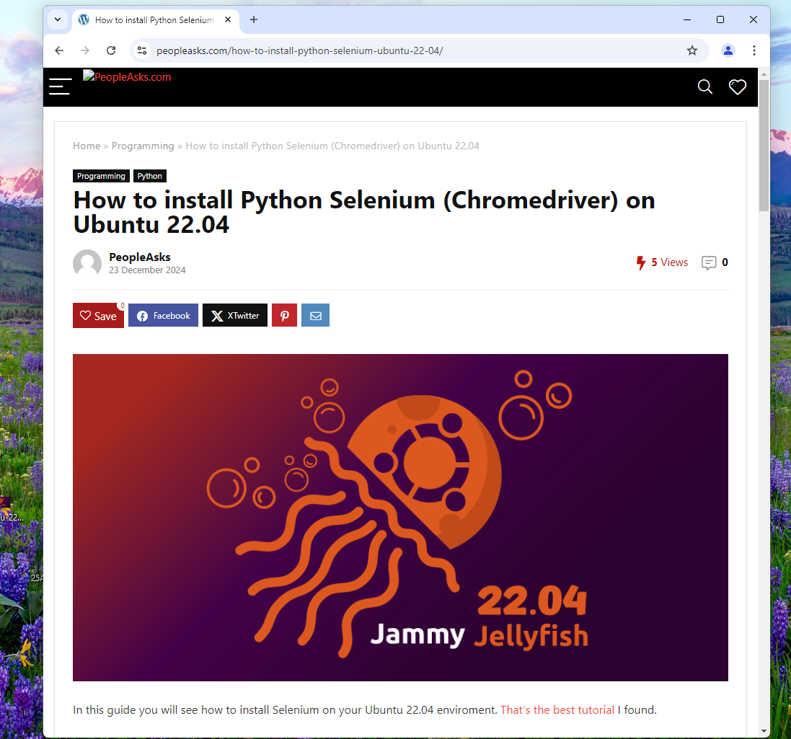

# OpenBrowser

OpenBrowser will help you to open Selenium Browser in one line of code. This is the first release, so you can only open chrome
Based on the tutorial here on [PeopleAsks.com](https://www.peopleasks.com/how-to-install-python-selenium-ubuntu-22-04/)
# Buy me a Beer 🍻
If you wish support me you can buy me a Cripto Beer

### Bitcoin:
[](bitcoin:bc1qks9svw4udfgh23dn3n92jmlkh2hx4sudytdlg9)

### BNB Smart Chain:
[](https://bscscan.com/address/0x80AAF991580685b39c618a0708884d05d8EB137f) 
[](https://bscscan.com/address/0x80AAF991580685b39c618a0708884d05d8EB137f) 
[](https://bscscan.com/address/0x80AAF991580685b39c618a0708884d05d8EB137f) 
[](https://bscscan.com/address/0x80AAF991580685b39c618a0708884d05d8EB137f)  
[](https://bscscan.com/address/0x80AAF991580685b39c618a0708884d05d8EB137f) 
[](https://bscscan.com/address/0x80AAF991580685b39c618a0708884d05d8EB137f)

All Donors Will be part of the sponsorship Div


### How to setup the package from GIT:

1. Clone the TrimoonCam2Telegram git repository ```pip install git+https://github.com/woopygit/OpenBrowser```
2. Install setuptools ```pip install setuptools```
3. ``` python3.7 absolute\path\to\OpenBrowser\setup.py install ```

### How to setup the package from PIP:

1. ```pip install OpenBrowser```

## How to use The Project:
1. Create a new .py file (ex. getbrowser.py)
2. include the class OpenBrowser(BrowserWidth[str], BrowserHeight[str], Headless[bool]:def = True)
3. Open Chrome with OpenChrome()
4. Use the selenium syntax

## Full Code:

```bash
from OpenBrowser import *

Brows = OpenBrowser().OpenChrome(Headless=False)

Brows.get("https://www.peopleasks.com/how-to-install-python-selenium-ubuntu-22-04/")
input("Premi")
Brows.quit()
exit()
```


### Bitcoin:
[](bitcoin:bc1qks9svw4udfgh23dn3n92jmlkh2hx4sudytdlg9)

### BNB Smart Chain:
[](https://bscscan.com/address/0x80AAF991580685b39c618a0708884d05d8EB137f) 
[](https://bscscan.com/address/0x80AAF991580685b39c618a0708884d05d8EB137f) 
[](https://bscscan.com/address/0x80AAF991580685b39c618a0708884d05d8EB137f) 
[](https://bscscan.com/address/0x80AAF991580685b39c618a0708884d05d8EB137f)  
[](https://bscscan.com/address/0x80AAF991580685b39c618a0708884d05d8EB137f) 
[](https://bscscan.com/address/0x80AAF991580685b39c618a0708884d05d8EB137f)

All Donors Will be part of the sponsorship Div

# Hall of Fame:
1. [PeopleAsks.com](https://www.peopleasks.com/how-to-install-python-selenium-ubuntu-22-04/)
2. [CpAff.net](https://www.cpaff.net)
3. [classifiche.net](https://www.classifiche.net)


